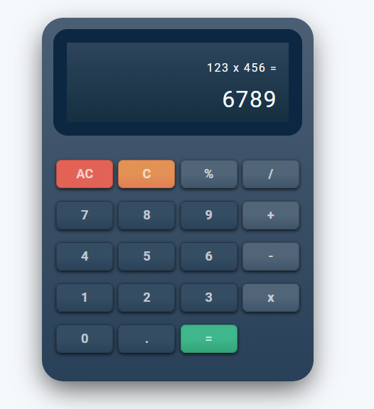

# Etch A Sketch 

This is a solution to the project: Calculator from The Odin Project's [curriculum](https://www.theodinproject.com/paths/foundations/courses/foundations/lessons/calculator).

## Table of contents

- [Overview](#overview)
  - [The challenge](#the-challenge)
  - [Screenshot](#screenshot)
  - [Links](#links)
- [My process](#my-process)
  - [Built with](#built-with)
  - [What I learned](#what-i-learned)
  - [Continued development](#continued-development)
  - [Useful resources](#useful-resources)
- [Author](#author)


## Overview

### The challenge

- Your calculator is going to contain functions for all of the basic math operators you typically find on simple calculators, so start by creating functions for the following items and testing them in your browser’s console.
  - add
  - subtract
  - multiply
  - divide

- [More details](https://www.theodinproject.com/paths/foundations/courses/foundations/lessons/calculator)

### Screenshot




### Links

🔗 **Live preview:** [link:]()

## My process

### Built with

- Semantic HTML5 markup
- CSS custom properties
- CSS Grid
- JavaScript

### What I learned

* JavaScript.
* HTML DOM manipulation with Javascript.
* Generating DOM elements from JavaScript

```html

```
```css

```
```js

```

### Continued development


### Useful resources

- The Odin Project's [Course](https://www.theodinproject.com/paths/foundations/courses/foundations/lessons/dom-manipulation) - This helped me understand how to carry out DOM manipulation.


## Author

👤 **Manik Rana**
* GitHub: [Maniktherana](https://github.com/Maniktherana)

💻 **The Odin Project**
* (https://www.theodinproject.com/home)
