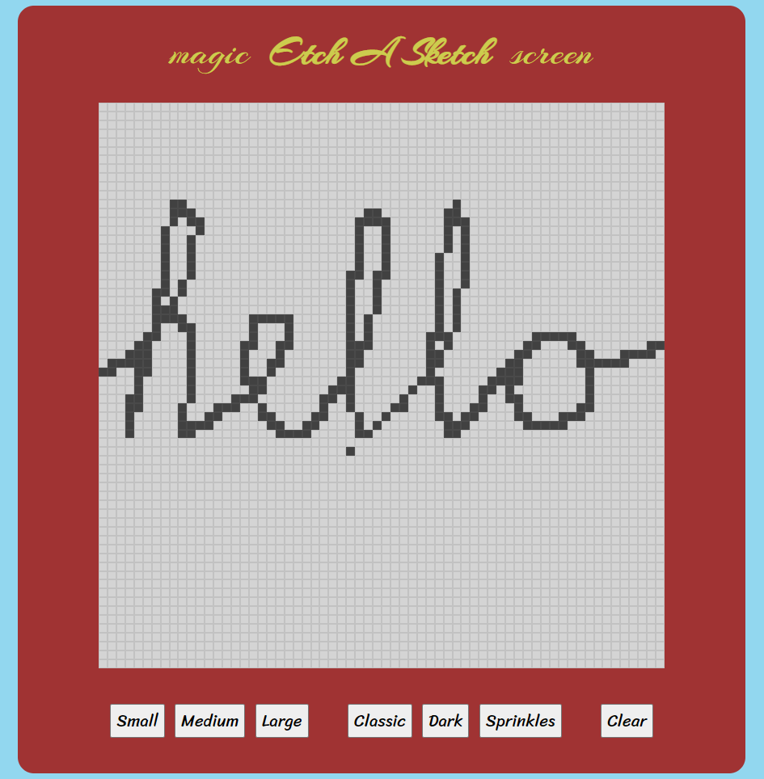

# Etch A Sketch 

This is a solution to the project: ETCH-A-SKETCH from The Odin Project's [curriculum](https://www.theodinproject.com/courses/foundations/lessons/html-css).

## Table of contents

- [Overview](#overview)
  - [The challenge](#the-challenge)
  - [Screenshot](#screenshot)
  - [Links](#links)
- [My process](#my-process)
  - [Built with](#built-with)
  - [What I learned](#what-i-learned)
  - [Continued development](#continued-development)
  - [Useful resources](#useful-resources)
- [Author](#author)


## Overview

### The challenge

- In this project you’ll be creating a pretty neat toy for your portfolio to flex your DOM manipulation skills. You’re going to build a browser version of something between a sketchpad and an Etch-A-Sketch.

- (Optional): Instead of just changing the color of your grid from black to white (for example) have each pass through it with the mouse change to a completely random RGB value. Then try having each pass just add another 10% of black to it so that only after 10 passes is the square completely black.

- [More details](https://www.theodinproject.com/paths/foundations/courses/foundations/lessons/etch-a-sketch-project#assignment)

### Screenshot




### Links

🔗 **Live preview:** [here](https://maniktherana.github.io/etch-a-sketch/)

## My process

### Built with

- Semantic HTML5 markup
- CSS custom properties
- CSS Grid
- JavaScript

### What I learned

* JavaScript.
* HTML DOM manipulation with Javascript.
* Generating DOM elements from JavaScript

```html
<div class="grid-container">

        </div>
```
```css
.grid-container {
    display: grid;
    margin: 0.5em;
    width: 700px;
    height: 700px;
    background-color: rgb(212, 212, 212);
}

.grid-item {
    border: 0.5px solid rgba(116, 115, 115, 0.185);
    text-align: center;
}
}
```
```js
/**
 * Fill grid-container with an 16x16 grid of square divs with class .grid-item.
 * @param {string} gameMode The current game mode
 */
function mediumGrid(gameMode) {
    
    // Remove current grid
    eraseGrid()

    // Set CSS for gridContainer
    gridContainer.setAttribute('style', 'grid-template-columns: repeat(32, 1fr); grid-template-rows: repeat(32, 1fr)');    
    
    // Make a 16x16 grid of square divs
    for (let i = 0; i < 1024; i++) {
        let div = document.createElement('div')
        div.setAttribute('id', i); 
        div.classList.toggle('grid-item')
        gridContainer.appendChild(div)
    }
    
    // Color grid with current game mode
    hoverColor(gameMode)

}
```

### Continued development

I haven't been able to add the optional feature where a square is darkened on mouse hover.

### Useful resources

- The Odin Project's [Course](https://www.theodinproject.com/paths/foundations/courses/foundations/lessons/dom-manipulation) - This helped me understand how to carry out DOM manipulation.
- This [Article](https://stackoverflow.com/questions/63364328/on-mouseover-event-listener-not-changing-color-of-grid-item-div) on stack overflow helped me change color on mouse hover


## Author

👤 **Manik Rana**
* GitHub: [Maniktherana](https://github.com/Maniktherana)

💻 **The Odin Project**
* (https://www.theodinproject.com/home)
